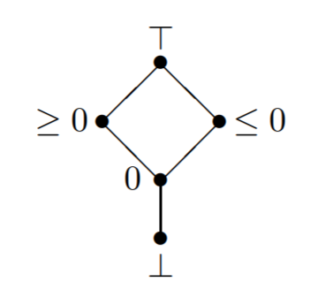
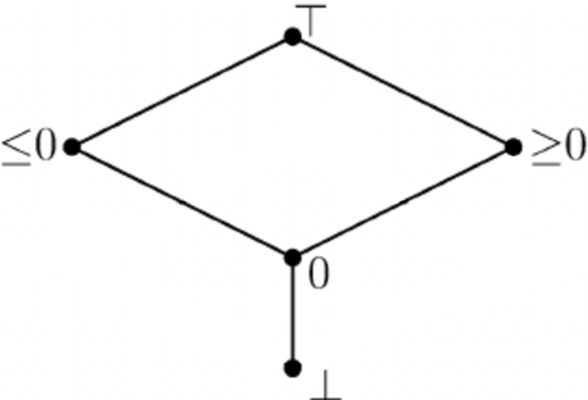
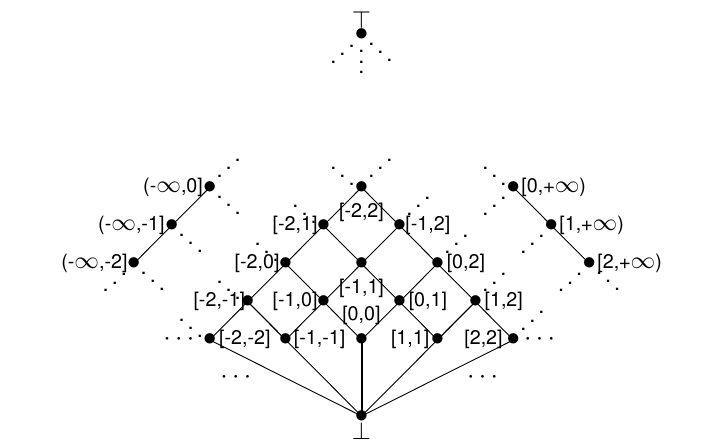
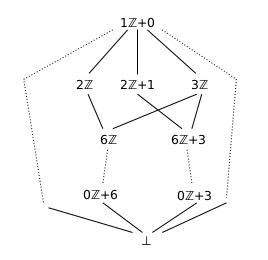
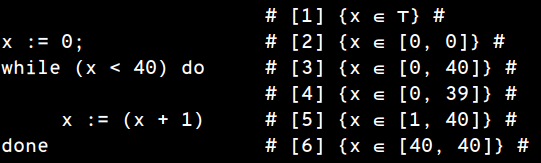
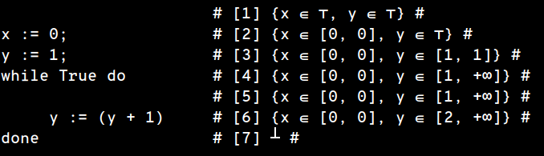
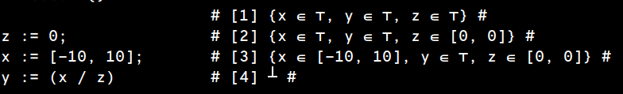

# wstat

[](https://circleci.com/gh/parof/wstat) [](https://en.wikipedia.org/wiki/Soundness)


Wstat a statical analyzer for the _While_ toy language. It relies on [Abstract Interpretation](https://en.wikipedia.org/wiki/Abstract_interpretation) for run a _sound_ analysis.

* [While Language](#while-language)
* [About abstract interpretation](#about-abstract-interpretation)
* [Installation](#installation)

## While Language

The syntax of the While language is given by the following grammar.

```haskell
Stmt  : Var := AExpr
      | assert BExpr
      | Stmt ; Stmt
      | skip
      | if BExpr then Stmt else Stmt endif
      | while BExpr do Stmt done

AExpr : ( AExpr )
      | Int
      | Var
      | AExpr + AExpr
      | AExpr - AExpr
      | AExpr * AExpr
      | AExpr / AExpr
      | [Int   , Int]
      | [neginf, Int]
      | [Int   , posinf]
      | [neginf, posinf]

BExpr : ( BExpr )
      | Bool
      | not BExpr
      | BExpr and BExpr
      | BExpr or  BExpr
      | AExpr !=  AExpr
      | AExpr  =  AExpr
      | AExpr <=  AExpr
      | AExpr >=  AExpr
      | AExpr  <  AExpr
      | AExpr  >  AExpr

Var   : [a-z][a-zA-Z]*
Int   : [1-9][0-9]*
Bool  : true | false
```

One can include comments surrounding them in `#`s

### Examples

```python
x := 0;
while x < 40 do
    x := (x + 1)
done
```

```python
x := [0, posinf]; # nondeterministic choice #
if (x <= 10) then
    y := 1
else
    y := 0
endif
```

```python
x := 0;
y := 1;
while true do
    y := y + 1
done
```

## About abstract interpretation

The `wstat` tool is based on _abstract interpretation_. It analyzes a source program code and infers _sound invariants_. You can choose between five different [abstract domains](https://en.wikipedia.org/wiki/Abstract_interpretation#Examples_of_abstract_domains):

- **Simple Sign Domain**:


- **Sign Domain**:


- **Interval Domain**:


- **Congruence Domain**:



- **Reduction (Interval x Congruence) Domain**

Here you can see some results using the interval domain:







### Adding a new Concrete non-relational domain

It is possible to implement a new domain and plug it in wstat, this domain has to comply with some conditions:
1. The domain has to be a non-relational domain
2. The State domain correspond to the new domain has to be representable in a map to be automatically inferred, anyway the State domain auto-inferred from the given Value domain defines only the abstract domain operations, it does not define the conditional operator

To define a new domain you have to follow these steps:
1. Build the (non-relational) domain, add the new module in the ```src/Domains``` directory
2. Add the new domain's name in the `Domains.DomainsList` module
3. Add the corresponding initial-state builder in the `InitialStateBuilder` module
4. Add in the main the procedure to run the analysis instantiated with the relative initial-state builder

### Run Key examples

All the key examples initialized their variables, you do not have to init them. For each concrete domain implemented we have done a couple of key examples:

- **Sign Domain**:

  - sign

- **Interval Domain**:

  - i

- **Congruence Domain**:

  - congruence

- **Reduction (Interval x Congruence) Domain**:

  - product


## Installation

### Installation prerequisites

- [Stack](https://docs.haskellstack.org/en/stable/README/) (version 1.7.1 or newer)

On Unix System install as:
```bash
curl -sSL https://get.haskellstack.org/ | sh
```
Or
```bash
wget -qO- https://get.haskellstack.org/ | sh
```

### Get Started

Before the first use build dependecies:
```bash
./init
```

Build the project:
```bash
./build
```

Test the project:
```bash
./spec
```

Run the project:
```bash
./run
```

## Authors

* **Denis Mazzucato** - [denismazzu96](https://github.com/denismazzu96)
* **Francesco Parolini** - [parof](https://github.com/parof)

## License

This project is licensed under the BSD-3 License - see the [LICENSE.md](LICENSE.md) file for details
